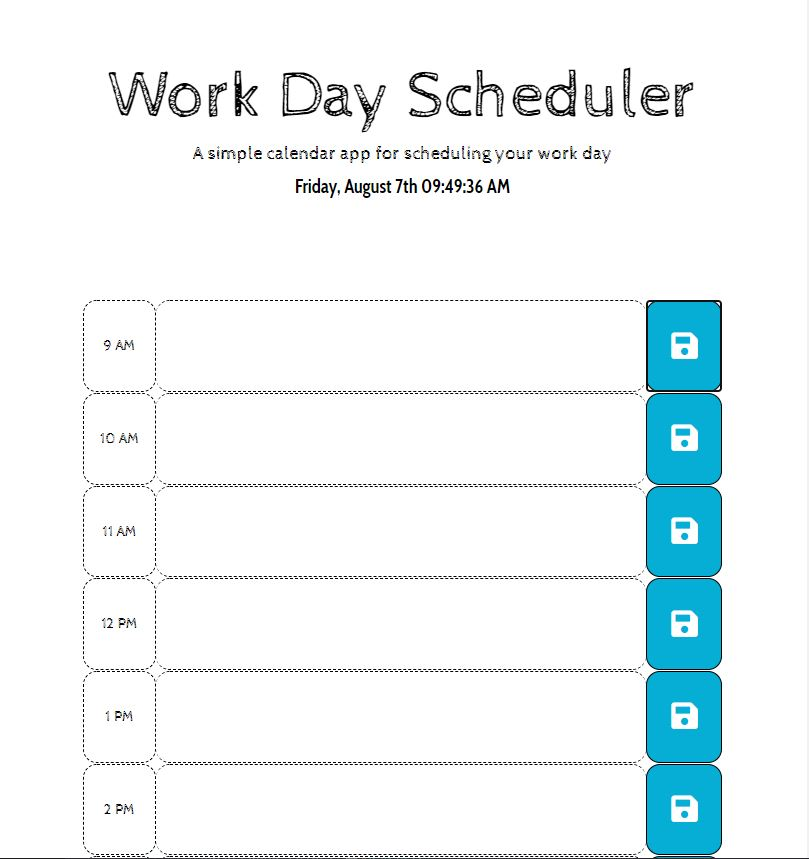

# README - School Day Planner

**Version 1.0.0**

School Day Planner customized for school.

----

This project has been created with the intent to make student an easier and more dynamic day planner.

### Instructions

- Student will write the tasks for the day between 9 AM to 5 PM.
- When student click the saved button, the task will be saved to local storage.
- when student accomplished the task will delete the task and push saved.
- The task will disappear from the planner.

---

Link: https://williamsffc.github.io/Day-Planner/

---

Screenshot of the project.

##  License & Copyright

© Williams F Flores - 2020
